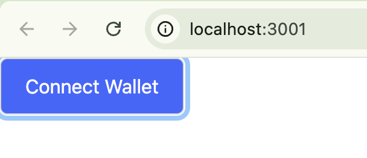

# Aptos TS sdk Case

## 资源

https://aptos.dev/en/build/guides/build-e2e-dapp

# 一、本地运行 / 开发

```bash
cd ts-case
pnpm i
pnpm run dev
```

# 二、使用教程

## （一）准备工作

### A. 集成钱包 (aptos adapter)

1. 创建用于布局 `layout.tsx` 的钱包 Provider 组件 `WalletProvider.tsx`

1.1 安装 npm 包

```bash
pnpm install @aptos-labs/ts-sdk
pnpm install @aptos-labs/wallet-adapter-react
```

1.2 创建 `app/components/WalletProvider.tsx`

```ts
'use client'
import { AptosWalletAdapterProvider } from '@aptos-labs/wallet-adapter-react'
import { Network } from '@aptos-labs/ts-sdk'
import { PropsWithChildren } from 'react'

export const WalletProvider = ({ children }: PropsWithChildren) => {
  return (
    <>
      <AptosWalletAdapterProvider
        plugins={[]}
        autoConnect={true}
        dappConfig={{
          network: Network.TESTNET,
          aptosConnectDappId: 'dapp-id',
        }}
      >
        {children}
      </AptosWalletAdapterProvider>
    </>
  )
}
```

2. 在页面中使用，写在 `app/layout.tsx`

```ts
import { WalletProvider } from '@/components/WalletProvider'
import '../globals.css'

export default function RootLayout({
  children,
}: Readonly<{
  children: React.ReactNode
}>) {
  return (
    <>
      <html lang="en">
        <head>
          <meta name="" content="ao" />
        </head>
        <body>
          <WalletProvider>{children}</WalletProvider>
        </body>
      </html>
    </>
  )
}
```

3. 创建 Wallet 按钮

3.1 安装 npm 包

```bash
pnpm i @aptos-labs/wallet-adapter-ant-design
```

3.2 创建 `src/components/WalletButton.tsx`

```ts
'use client'
import { WalletSelector } from '@aptos-labs/wallet-adapter-ant-design'
import '@aptos-labs/wallet-adapter-ant-design/dist/index.css'
const WalletButton = () => {
  return (
    <>
      <WalletSelector />
    </>
  )
}
```

4. 在 `app/page.tsx` 中使用 `WalletButton`

```ts
import WalletButton from '@/components/WalletButton'

export default function Home() {
  return (
    <>
      <WalletButton />
    </>
  )
}
```

> 如果出现错误，可以排查是否没有使用 `use client`，因为 adapter 的组件渲染过程全部在客户端，如果没有此标记，则会报错

**创建成功:**



# 二、获取链上数据

1. 查合约 event 的 rpc

2. 查询

---

# 附录

## 资源

```bash
# create next app
npx create-next-app@latest
# create react app
pnpm create vite@latest
# install headless ui
pnpm install @headlessui/react@latest
# math lib
pnpm install bignumber.js
#
pnpm install @aptos-labs/aptos-faucet-client

```

基础合约

```rust
module 0x1::coin {
    resource struct Coin {
        value: u64,
    }

    public fun create_empty_coin(): Coin {
        Coin { value: 0 }
    }

    public fun create_coin(value: u64): Coin {
        Coin { value }
    }

    public fun add_coin(&mut coin_a: Coin, &mut coin_b: Coin) {
        coin_a.value = coin_a.value + coin_b.value;
    }

    public fun sub_coin(&mut coin_a: Coin, &mut coin_b: Coin) {
        assert!(coin_a.value >= coin_b.value);
}
```
