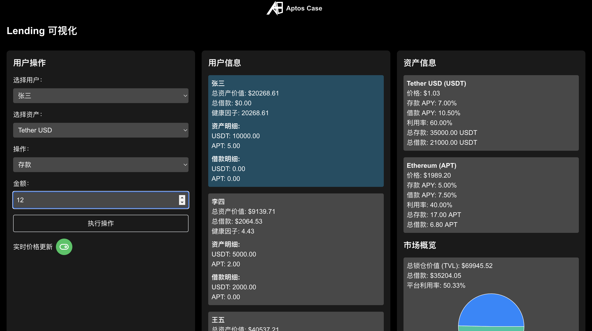

# Aptos-Case 

> Revolutionizing blockchain learning: A comprehensive blockchain learning library designed to help **Chinese beginners and developers** quickly master blockchain programming techniques and common protocols.

选择语言: **** 

 

# Project Introduction

Online website: https://aptos-case.vercel.app/

This is a Move language tutorial website for the Aptos public chain, aimed at helping beginners quickly get started with the Move language and blockchain.
The tutorial involves visualizing the principles of common on-chain protocols, helping beginners better understand blockchain technology.

## Core Platform Features

    

### 1. Principle Visualization

Through dynamic graphics and interactive animations, we transform complex blockchain concepts into intuitive visual experiences. From consensus mechanisms to common protocols, abstract theories become clear and visible here.

### 2. Centralized Knowledge Base

We've built a document resource library, including official documentation, community articles, and industry research. This one-stop knowledge base allows you to efficiently find and learn all the information you need.

### 3. Proposal Exploration Tool

Delve deep into the proposals shaping the future of blockchain. Our tool allows you to analyze, discuss, and even participate in the latest blockchain improvement proposals, keeping you at the forefront of technological development.

### 4. Code Behavior Gamification

Transform programming learning into an engaging adventure. Through coding, you'll understand what behaviors each line of code produces on the blockchain, deepening your memory. You'll quickly improve your skills while enjoying the learning process.

### 5. Project-based Tutorials

Convert theoretical knowledge into practical skills through a series of carefully designed hands-on projects. From simple token creation to complex DeFi protocols, each project will enhance your practical abilities.

### 6. Development Environment Simulation

Experience a real blockchain development environment without complex setups. Our platform simulates the complete development process, from coding to deployment, testing to optimization, allowing you to practice development anytime, anywhere.

### 7. Frontend Compilation Technology

Compile and run smart contract code directly in the browser. This innovative feature greatly simplifies the development process, allowing you to instantly validate ideas and quickly iterate projects.

### 8. Contract Security Education

In the blockchain world, security is crucial. We provide comprehensive security courses covering common vulnerability analysis, secure coding practices, and auditing techniques to ensure you can develop safe and reliable smart contracts.

### 9. Embedded Code Examples

Seamlessly integrate runnable code examples in the editor. This learn-by-doing approach allows you to immediately apply what you've learned, deepening your understanding.

# Why Choose Our Platform?

- **Innovative Learning Methods**: Combining visualization, gamification, and project-based learning makes complex blockchain concepts easy to understand and master.
- **Comprehensive Skill Development**: From basic theory to advanced applications, from coding practice to security auditing, improve your blockchain development skills in all aspects.
- **Real Development Experience**: Provide the closest to actual development practice through environment simulation and frontend compilation, fully preparing you for your career development.
- **Flexible Learning Methods**: Portable learning tools and rich online resources allow you to learn and develop anytime, anywhere.
- **Keeping Up with Technological Frontiers**: Stay on top of the latest blockchain technology trends through proposal exploration tools and constantly updated course content.

Whether you're a newcomer just entering the blockchain world or an experienced developer seeking advancement, our platform can provide you with the ideal learning path and resources. Here, you'll not only learn coding but also gain a deep understanding of the core of blockchain technology, laying a solid foundation to become a top blockchain developer.

## UI Showcase

### Quick Start

View online: https://aptos-case.vercel.app

### NFT Project Tutorial

View online: https://aptos-case.vercel.app/track_nft

### Aptos Command Line Tool

View online: https://aptos-case.vercel.app/track_aptos_cli

### Move Basic Syntax

View online: https://aptos-case.vercel.app/track_basic_syntax

## Visualization (Interactive)

### Swap

View online: https://aptos-case.vercel.app/visualization/swap

### Blockchain

View online: https://aptos-case.vercel.app/visualization/blockchain

### Lending

View online: https://aptos-case.vercel.app/visualization/lending

### NFT

View online: https://aptos-case.vercel.app/visualization/nft

## Contract Security

View online: https://aptos-case.vercel.app/safety

## Move in Games

### Move Game

View online: https://aptos-case.vercel.app/game

## Other Resources

### Tools

### Move Handbook

## Proposal Board

View online: https://aptos-case.vercel.app#Proposal-Board

### Documentation

View online: https://aptos-case.vercel.app/doc

> Currently using sample data
