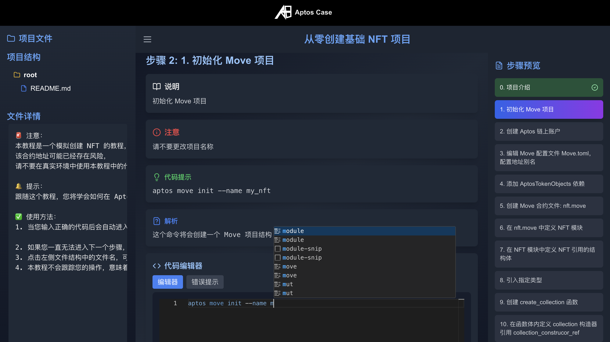
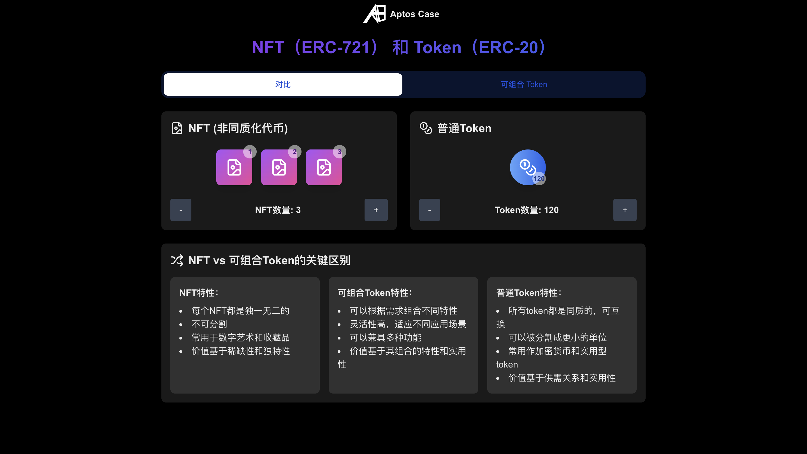
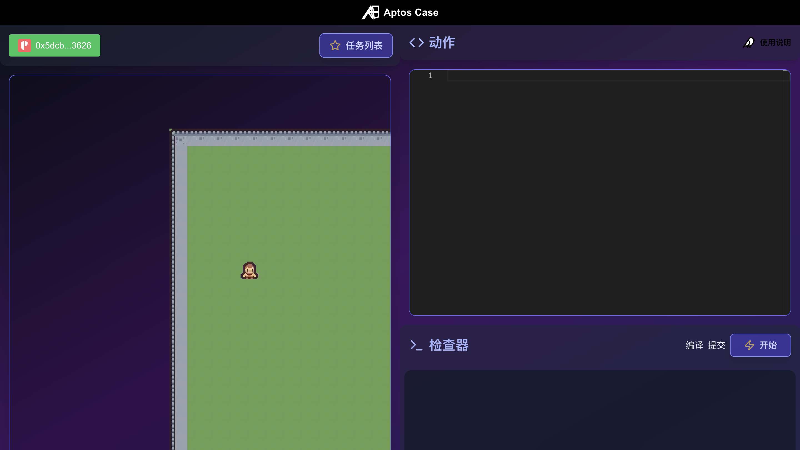
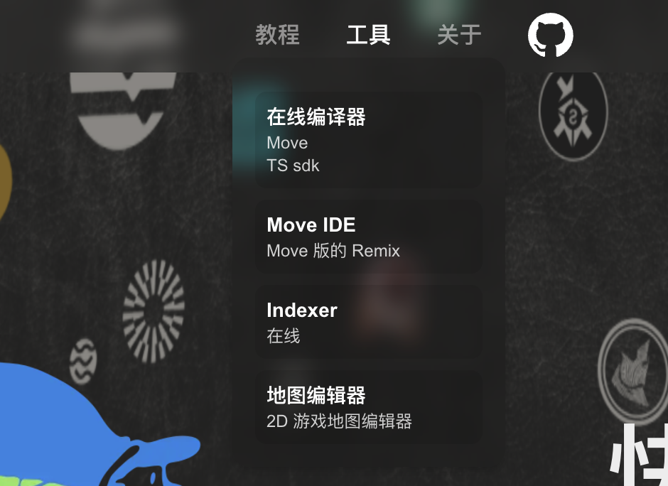
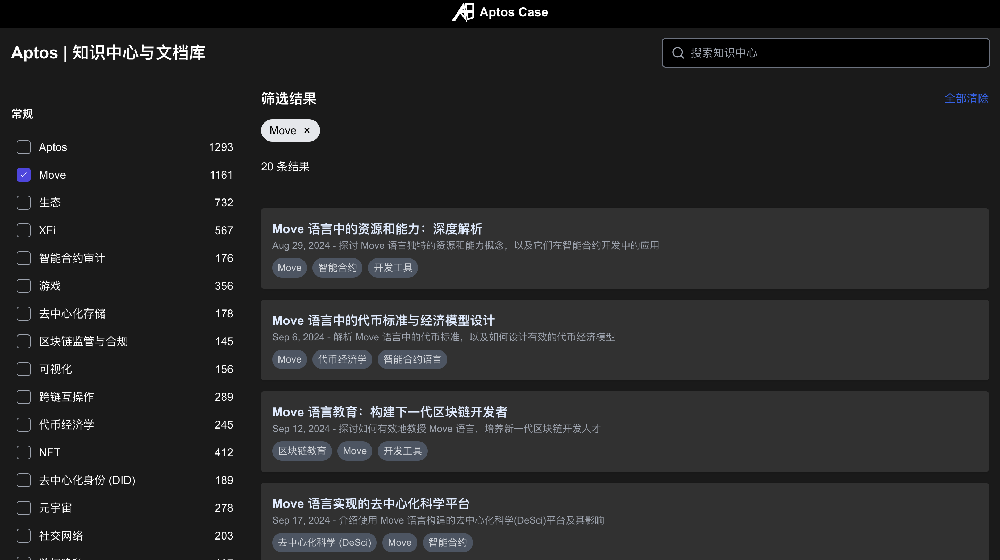

# Aptos-Case 

> 革新区块链学习：全方位区块链学习库，旨在帮助**中国的初学者和开发者**快速掌握区块链编程技术和常见协议。

Choose Language：**** 

 

# 项目介绍

在线网站： https://aptos-case.vercel.app/

这是一个 Aptos 公链的 Move 语言教程网站，旨在帮助初学者快速入门 Move 语言和区块链。
教程涉及链上常见协议的原理可视化，帮助初学者更好地理解区块链技术。

## 平台核心特性

    

### 1. 原理可视化

通过动态图形和交互式动画，我们将复杂的区块链概念转化为直观易懂的视觉体验。从共识机制到常见协议，抽象理论在这里变得清晰可见。

### 2. 集中知识库

我们建立了文档资源库，包括官方文档、社区文章、行业研究。这个一站式知识库让您能够高效地查找和学习所需的一切信息。

### 3. 提案探索工具

深入了解正在塑造区块链未来的提案。我们的工具允许您分析、讨论并甚至参与到最新的区块链改进提案中，让您站在技术发展的前沿。

### 4. 代码行为游戏化

将编程学习转化为一场引人入胜的冒险。通过编码，您将理解每一句代码在区块链上都会产生哪些行为，这能加深您的记忆，您将在享受学习过程的同时快速提升技能。

### 5. 项目式教程

通过一系列精心设计的实战项目，将理论知识转化为实际技能。从简单的代币创建到复杂的 DeFi 协议，每个项目都将提升您的实战能力。

### 6. 开发环境模拟

体验真实的区块链开发环境，无需复杂设置。我们的平台模拟了完整的开发流程，从编码到部署、测试到优化，让您随时随地进行开发实践。

### 7. 前端编译技术

直接在浏览器中编译和运行智能合约代码。这项创新功能大大简化了开发流程，让您能够即时验证想法，快速迭代项目。

### 8. 合约安全教育

在区块链世界中，安全至关重要。我们提供全面的安全课程，涵盖常见漏洞分析、安全编码实践和审计技巧，确保您能够开发出安全可靠的智能合约。

### 9. 嵌入式代码示例

在编辑器中无缝集成可运行的代码示例。这种即学即练的方法让您能够立即应用所学知识，加深理解。

# 为什么选择我们的平台？

- **创新学习方法**：结合可视化、游戏化和项目式学习，让复杂的区块链概念变得易于理解和掌握。
- **全面的技能培养**：从基础理论到高级应用，从编码实践到安全审计，全方位提升您的区块链开发技能。
- **真实的开发体验**：通过环境模拟和前端编译，提供最接近实际的开发练习，为您的职业发展做好充分准备。
- **灵活的学习方式**：便携的学习工具和丰富的在线资源，让您能够随时随地进行学习和开发。
- **紧跟技术前沿**：通过提案探索工具和不断更新的课程内容，确保您始终掌握最新的区块链技术动态。

无论您是刚步入区块链世界的新手，还是寻求进阶的经验开发者，我们的平台都能为您提供理想的学习路径和资源。在这里，您将不仅学习编码，更将深入理解区块链技术的核心，为成为顶尖的区块链开发者奠定坚实基础。

## UI 展示

### 快速开始

在线查看： https://aptos-case.vercel.app

### NFT 项目教程

在线查看： https://aptos-case.vercel.app/track_nft

### Aptos 命令行工具

在线查看： https://aptos-case.vercel.app/track_aptos_cli

### Move 基础语法

在线查看： https://aptos-case.vercel.app/track_basic_syntax

## 可视化（交互）

### Swap

在线查看： https://aptos-case.vercel.app/visualization/swap

### 区块链

在线查看： https://aptos-case.vercel.app/visualization/blockchain

### Lending

在线查看： https://aptos-case.vercel.app/visualization/lending

### NFT

在线查看： https://aptos-case.vercel.app/visualization/nft

## 合约安全

在线查看： https://aptos-case.vercel.app/safety

## 游戏中的 Move

### Move 游戏

在线查看： https://aptos-case.vercel.app/game

## 其他资源

### 工具

### Mvoe 手册

## 提案看板

在线查看： https://aptos-case.vercel.app#提案看板

### 文档

在线查看： https://aptos-case.vercel.app/doc

> 目前是示例数据
