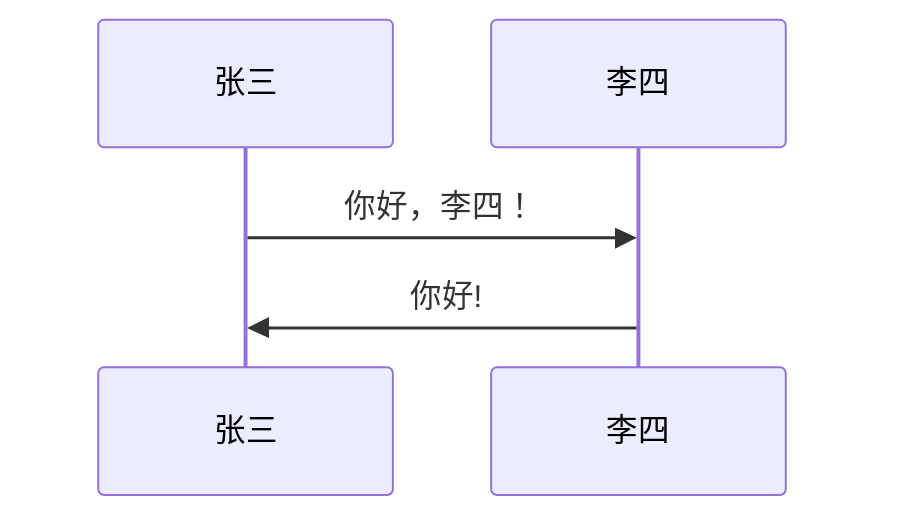
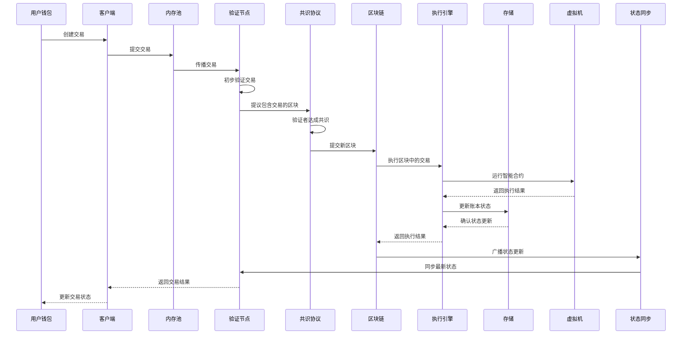
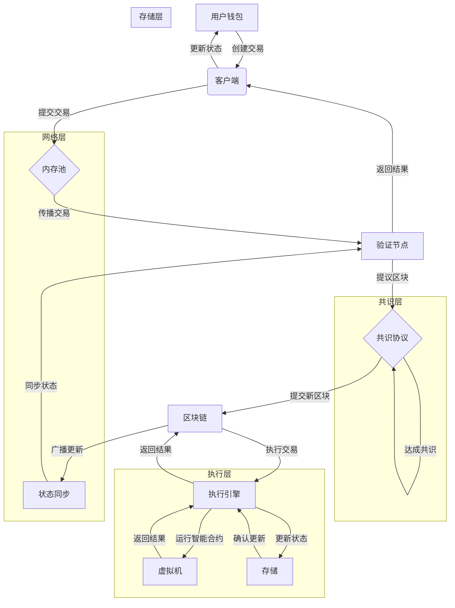
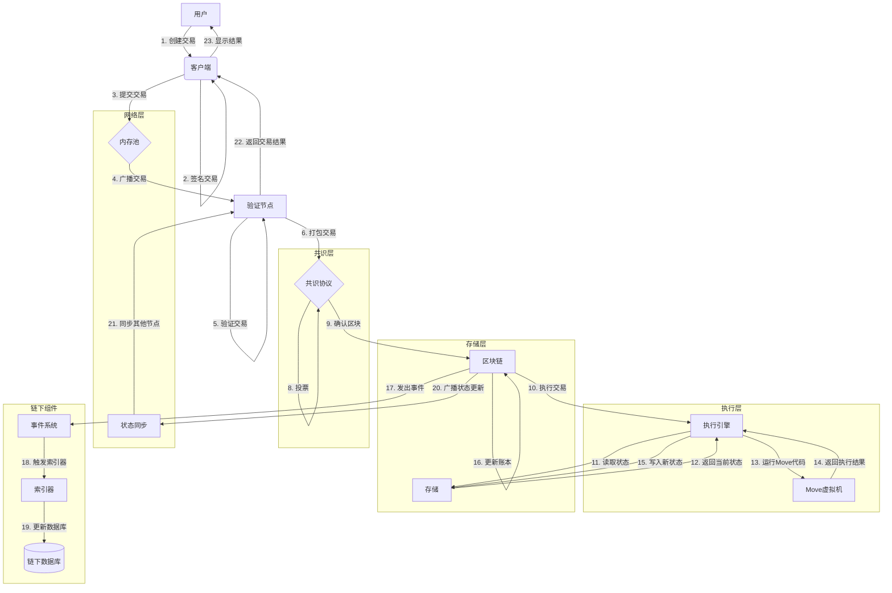

# x



# x



# x



# xx



| 左对齐 | 右对齐 | 居中对齐 |
| :----- | -----: | :------: |
| 单元格 | 单元格 |  单元格  |
| 单元格 | 单元格 |  单元格  |

11. 任务列表

    ```markdown
    - [ ] 未完成
    - [x] 完成
    ```

    - 示例
      - [x] 未完成
      - [x] 完成

12. html 支持

<kbd> <b> <i> <em> <sup> <sub> <br>

例如：

<kbd>Ctrl</kbd>+<kbd>Alt</kbd>+<kbd>Del</kbd>重启

13. 转义

    \ 反斜线
    支持的符号 （这些符号在 md 中有意义，可以进行一些格式操作，反斜线可以让它们以文本显示）
    ` 反引号

    - 星号
      \_ 下划线
      {} 花括号
      [] 方括号
      () 小括号

    # 井字号

    - 加号

    * 减号
      . 英文句点
      ! 感叹号

    ```

    ```
