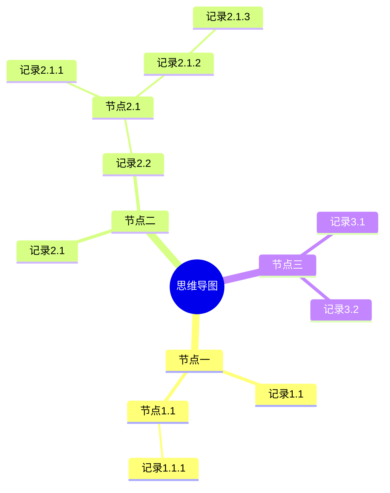
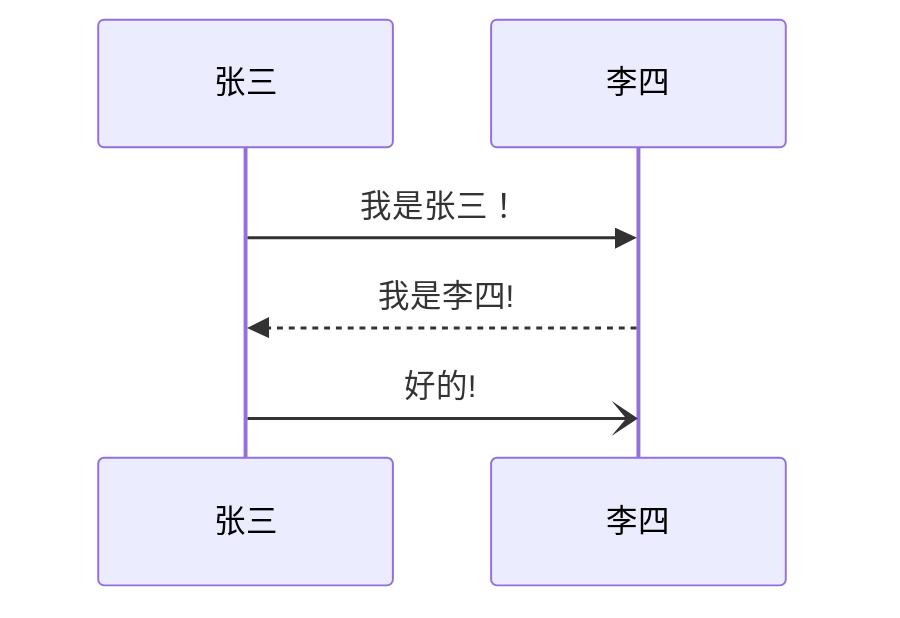
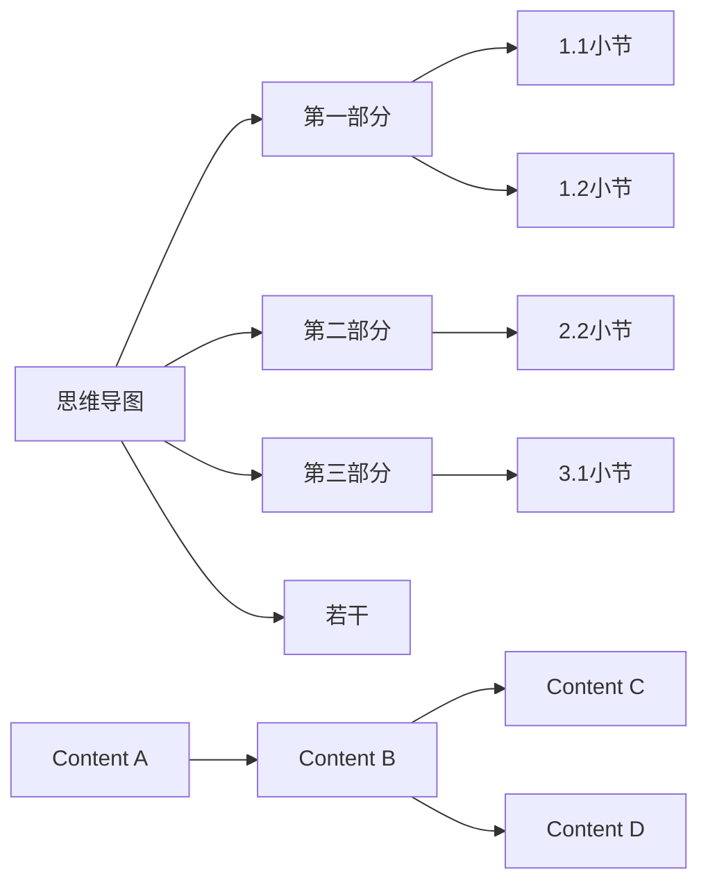
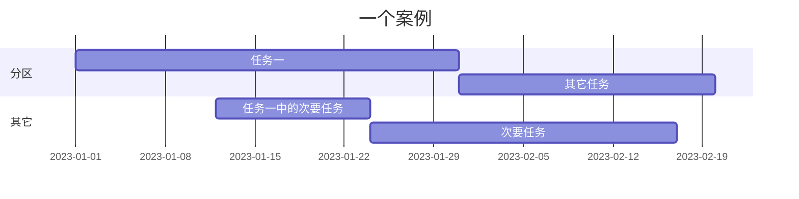
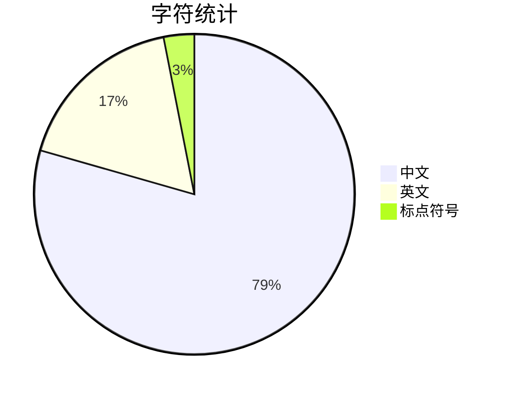

```move
module 0x1::BasicCoin {
    use std::signer;

    struct Coin has key {
        value: u64,
    }

    public fun mint(account: &signer, value: u64) {
        move_to(account, Coin { value })
    }

    public fun balance_of(owner: address): u64 acquires Coin {
        borrow_global<Coin>(owner).value
    }
}
```

```pass
aptos move test
[ERROR]
[PASS]
```

```error
aptos mvoe test
[ERROR]
[PASS]
```

```aptos
aptos mvoe test
[ERROR]
[PASS]
```

```rust
mod
```

---

title: Thompsgo 使用方法
author: caoyang
creator: caoyang
subject: Usage
keywords: [使用方法、markdown、HTML、YAML]
info: 这是一本关于 thompsgo 主题的手册，内含 markdown、mermiad、html 等语言和的基础语法。本主题由 @caoyang2002.top 开发，开源地址：https://github.com/caoyang2002/Thompsgo.git

---

<blockquote alt="success"><p>目录</p></blockquote>

[toc]

<div style="page-break-after:always"></div>

# 一、Thompsgo 主题简介

<font title="blue"><span>感谢 dyzj、黑石、github、krafty、purple、Volantis、stack overflow 等主题和网站作者的开发和讲解，本主题在他们的基础上进行开发</span></font>

<font title="blue"><span>本主题免费开源</span></font>

> 源代码达`1500行`, `50%` 的代码都是注释，没写的基本是可以搜到的，还有一些是我不确定作用功能的代码 ，想自定义的可以去看看我在源码里面写的注释和使用方法，可以直接把建议和问题反馈到我的邮箱`cy12968@163.com`，我会尽快处理。

- `Thompsgo`是`Typora`软件（一个 Markdown 编辑器）的主题
- `Markdown `是一种轻量级标记语言，它允许编辑者使用易读易写的纯文本格式编写文档，不需要鼠标也能完成排版，相对于 Word、html 等格式的文档，它更高效。[^markdown为何高效]
- 包含一个文件和一个文件夹，文件夹内是主题的背景图和字体（开源字体）

<div style="page-break-after:always"></div>

<blockquote alt="success"><p>开始阅读</p></blockquote>

# 二、解决方案

## 1. 我的期望

1. 让文字编辑页面有比较暖的色彩，增加一些质感
2. 文字不要太硬
3. 增加图片效果

## 2. 我的解决方案

1. 页面使用的是纸张的纹理作为全局背景，并把内容编辑区域改为透明
2. 基本字体使用的是可免费商用的`975 朦胧黑体`[^字体介绍][^字体授权说明]
3. 参考`dyzj`主题，制作了图片滤镜，可以使用中英文关键字显示

## 3. 目前的问题

1. 换行时会出现行间距太宽，通过查看源代码可以发现换了两个行
1. 纸张不会随着文字的滚动而滚动
1. 导出`PDF`时，背景无法完全覆盖纸张
1. 修改甘特图的日期会卡死，建议改代码语言后再修改
1. 首次打开可能会卡顿

# 三、基本编辑

> `Markdown`以下称作`md`
>
> `Thompsgo主题`以下称作`主题`
>
> `mermaid`，一种编辑和渲染器，可以编辑并展示思维导图、流程图、序列图、甘特图等多种矢量图形的，`typora`可直接使用
>
> 部分`markdown`不支持的样式比如<u>带下划线文字</u>或者 <span style="color:red">带颜色的文字</span>可以通过`html`实现

## 1. 基础语法

### 1.1 md 语法

[markdown 语法-菜鸟教程](https://www.runoob.com/markdown/md-tutorial.html)

- 如果不起作用请检查是否有空格或者尝试换行

1. 标题

   ```markdown
   # 一级标题

   ## 二级标题

   ### 三级标题

   #### 四级标题

   ##### 五级标题

   ###### 六级标题
   ```

2. 字体样式

   ```markdown
   斜体：
   _斜体文本_
   _斜体文本_

   粗体：
   **粗体文本**
   **粗体文本**

   斜粗体：
   **_粗斜体文本_**
   **_粗斜体文本_**

   删除线：
   ~~BAIDU.COM~~
   ```

   - 示例

     _斜体文本_
     **粗体文本**
     **_粗斜体文本_**
     ~~BAIDU.COM~~

3. 分割线

   ```markdown
   以下任意一种都可以

   ---

   ---

   ---

   ---
   ```

   - 示例

     ***

4. 脚注

   ```markdown
   [^要注明的文本]

   您可以像这样创建脚注[^footnote].
   [^footnote]: Here is the _text_ of the **footnote**.
   ```

   - 示例

     创建脚注格式类似这样 [^注]。
     [^注]: 这是一个注释

5. 列表（可嵌套）

   1. test

      6. test
         1. test
         2. test
      1. test

   2. test

- test

  - test
    - test
    - test
  - test

- test

```markdown
普通列表 字符 空格

- 第一项
- 第二项
- 第三项

* 第一项
* 第二项
* 第三项

有序列表：数字 点 空格

1. 第一项
2. 第二项
3. 第三项

- 第一项
- 第二项
- 第三项

嵌套列表：数字/字符 点 空格 数字/字符 点 空格

1. 第一项：
   - 第一项嵌套的第一个元素
   - 第一项嵌套的第二个元素
2. 第二项：
   - 第二项嵌套的第一个元素
   - 第二项嵌套的第二个元素
```

- 示例
  1.  第一项：
      - 第一项嵌套的第一个元素
      - 第一项嵌套的第二个元素
  2.  第二项：
      - 第二项嵌套的第一个元素
      - 第二项嵌套的第二个元素

6. 区块（引用）

   ```markdown
   单层饮用：尖括号 空格

   > 区块引用
   > 菜鸟教程
   > 学的不仅是技术更是梦想

   嵌套饮用：尖括号 空格 尖括号 空格

   > 最外层
   >
   > > 第一层嵌套
   > >
   > > > 第二层嵌套

   复合使用：
   区块中使用列表：

   > 1. 第一项
   > 2. 第二项
   >
   > - 第一项
   > - 第二项
   > - 第三项

   列表中使用区块

   - 第一项
     > 菜鸟教程
     > 学的不仅是技术更是梦想
   - 第二项
   ```

   - 示例

     - 第一项
       > 区块（引用）
     - 第二项

7. 代码

   ````markdown
   使用符号： ` 
   `代码`

   代码块：

   ```代码语言
   代码
   ```
   ````

   - 示例

     ```代码语言
     代码
     ```

8. 链接

   ```mariadb
   [链接名称](链接地址)
   [菜鸟教程](https://www.runoob.com)

   或者

   <链接地址>
   <https://www.runoob.com>
   ```

   - 示例

     [菜鸟教程](https://www.runoob.com)

     <https://www.runoob.com>

9. 图片

   

   ```mariadb
   图片地址可以是本地或网络地址
   

   
   ```

   - 使用 HTML 标签指定图片高度和宽度

   ```markdown
   
   ```

   - 示例

     

10. 表格

    ```markdown
    | 表头   | 表头   |
    | ------ | ------ |
    | 单元格 | 单元格 |
    | 单元格 | 单元格 |
    ```

    ```markdown
    | 左对齐 | 右对齐 | 居中对齐 |
    | :----- | -----: | :------: |
    | 单元格 | 单元格 |  单元格  |
    | 单元格 | 单元格 |  单元格  |
    ```

    - 示例

      | 左对齐 | 右对齐 | 居中对齐 |
      | :----- | -----: | :------: |
      | 单元格 | 单元格 |  单元格  |
      | 单元格 | 单元格 |  单元格  |

11. 任务列表

    ```markdown
    - [ ] 未完成
    - [x] 完成
    ```

    - 示例
      - [x] 未完成
      - [x] 完成

12. html 支持

    ```markdown
    <kbd> <b> <i> <em> <sup> <sub> <br>

    例如：
    <kbd>Ctrl</kbd>+<kbd>Alt</kbd>+<kbd>Del</kbd>重启
    ```

    - 示例

      <kbd>Ctrl</kbd>+<kbd>Alt</kbd>+<kbd>Del</kbd>重启

13. 转义

    ```markdown
    \ 反斜线
    支持的符号 （这些符号在 md 中有意义，可以进行一些格式操作，反斜线可以让它们以文本显示）
    ` 反引号

    - 星号
      \_ 下划线
      {} 花括号
      [] 方括号
      () 小括号

    # 井字号

    - 加号

    * 减号
      . 英文句点
      ! 感叹号
    ```

    - 示例

      \# \- \!

14. 公式

    - 支持[KaTeX](https://github.com/Khan/KaTeX) 或者 [MathJax](https://github.com/mathjax/MathJax) 公式渲染器

    ```markdown
    $$
    \begin{Bmatrix}
       a & b \\
       c & d
    \end{Bmatrix}
    $$
    ```

    - 示例

    $$
    \begin{Bmatrix}
       a & b \\
       c & d
    \end{Bmatrix}
    $$

    - ```mariadb
      $$
      \begin{CD}
      A @>a>> B \\
      @VbVV @AAcA \\
      C @= D
      \end{CD}
      $$
      ```

    - $$
      \begin{CD}
      A @>a>> B \\
      @VbVV @AAcA \\
      C @= D
      \end{CD}
      $$

    - ```markdown
      $$
      \mathbf{V}_1 \times \mathbf{V}_2 =  \begin{vmatrix}
          \mathbf{i} & \mathbf{j} & \mathbf{k} \\
          \frac{\partial X}{\partial u} &  \frac{\partial Y}{\partial u} & 0 \\
          \frac{\partial X}{\partial v} &  \frac{\partial Y}{\partial v} & 0 \\
          \end{vmatrix}
      $$
      ```

    - $$
      \mathbf{V}_1 \times \mathbf{V}_2 =  \begin{vmatrix}
          \mathbf{i} & \mathbf{j} & \mathbf{k} \\
          \frac{\partial X}{\partial u} &  \frac{\partial Y}{\partial u} & 0 \\
          \frac{\partial X}{\partial v} &  \frac{\partial Y}{\partial v} & 0 \\
          \end{vmatrix}
      $$

    ```markdown
    $\lim_{x \to \infty} \exp(-x) = 0$
    ```

    $\lim_{x \to \infty} \exp(-x) = 0$

15.

16. 表情

    ```markdown
    :smile:
    ```

    - 示例

    :smile:

    :tent:

    :hand:

    :camera:

17.

18. 目录

    ```markdown
    自动依据‘#’标签生成目录
    [toc]
    ```

19. YAML

```markdown
Typora 现在支持 YAML Front Matter 。 在文章顶部输入 --- 然后按 Enter 键将引入一个，或者从菜单中插入一个元数据块。
```

2.

### Typora 支持

1. YAML

   - 这是一种编写元数据的数据序列化语言

   - 为什么使用

     > - 我们来看 markdown 的`#`其实表示的是`header`，严格意义上来说是一级标题而不是文章标题`title`，放在论文里来说就是`header 1`可以是前言、方法、结果、讨论等，但不是论文的题目。如此一来我们就需要一个用来存放 title 的地方，这就是 metadata 的存在的意义，当然它不仅仅能容纳 title，还可以加上 author、keywords、abstract 等信息[^知乎]。这些数据可以在文件的详细信息里面看到。
     >
     > - 实际上 YAML 还可以保存用于脚本的变量，以实现各种导出时的特殊要求

   - 使用方法

     ```markdown
     在文章顶部输入 --- 然后按 Enter 键将引入一个，或者从菜单中插入一个元数据块。
     ```

     - 添加文章作者和关键字等信息

     ```yaml
     ---
     title: 'This is the title: it contains a colon'
     author:
       - Author One
       - Author Two
     keywords: [nothing, nothingness]
     abstract: |
       This is the abstract.

       It consists of two paragraphs.
     ---
     ```

     - 例如

       ```yaml
       ---
       # 注释：导出的yaml设置
       title: Thompsgo使用方法
       author: 曹洋
       creator: 曹洋
       subject: Usage
       keywords: [使用方法、markdown、HTML、YAML]
       info: 这是一本关于thompsgo主题的手册，内含markdown、mermiad、html等语言和的基础语法。本主题由 @曹洋 开发，开源地址：https://github.io/caoyang2002
       ---
       ```

       ```html
       <!--注释：导出的html设置-->
       <meta title="title" content="${title}" />
       <meta info="info" content="${info}" />
       <meta author="author" content="${author}" />

       <div id="_export_cover" style="height:100vh;">
         <div
           id="_export_title"
           style="margin-top: 10%;text-align: center;font-size: 10rem;"
         ></div>
         <hr />
         <div>
           <div
             id="_export_info"
             style="margin-top: 4%;text-align: center;font-size: 1.5rem;"
           ></div>
           <p style="margin-left:10%;font-size: 1.8rem">
             &#128187; Mac专用 &#129412;
           </p>
           <div
             id="_export_author"
             style="margin-left: 80%;font-size: 2.5rem;"
           ></div>

           <script>
             var $cover = document.querySelector('#_export_cover')
             var title = document
               .querySelector("meta[title='title']")
               .getAttribute('content')
             var info = document
               .querySelector("meta[info='info']")
               .getAttribute('content')
             var author = document
               .querySelector("meta[author='author']")
               .getAttribute('content')

             if (
               !title ||
               title == '${title}' ||
               !author ||
               author == '${author}' ||
               !info ||
               info == '${info}'
             ) {
               // no title author info
               $cover.remove()
             } else {
               document.body.insertBefore($cover, document.body.childNodes[0])
               $cover.querySelector('#_export_title').textContent = title
               $cover.querySelector('#_export_info').textContent = info
               $cover.querySelector('#_export_author').textContent = author
             }
           </script>
         </div>
       </div>
       ```

2. 嵌入动画

   ```html
   <iframe
     height="265"
     scrolling="no"
     title="Fancy Animated SVG Menu"
     src="http://codepen.io/jeangontijo/embed/OxVywj/?height=265&theme-id=0&default-tab=css,result&embed-version=2"
     frameborder="no"
     allowtransparency="true"
     allowfullscreen="true"
     style="width: 100%;"
   ></iframe>
   ```

   - 示例

     <iframe height='265' scrolling='no' title='Fancy Animated SVG Menu' src='http://codepen.io/jeangontijo/embed/OxVywj/?height=265&theme-id=0&default-tab=css,result&embed-version=2' frameborder='no' allowtransparency='true' allowfullscreen='true' style='width: 100%;'></iframe>

3. 嵌入视频

   ```html
   <iframe
     src="//player.bilibili.com/player.html?aid=12178417&bvid=BV1Ux411q7qd&cid=20076875&page=1"
     height="770"
     scrolling="no"
     border="0"
     frameborder="no"
     framespacing="0"
     allowfullscreen="true"
   >
   </iframe>
   ```

   <iframe src="//player.bilibili.com/player.html?aid=12178417&bvid=BV1Ux411q7qd&cid=20076875&page=1" height="770"  scrolling="no" border="0" frameborder="no" framespacing="0" allowfullscreen="true"> </iframe>

4. 嵌入音频

   ```markdown
   <iframe frameborder="no" border="0" marginwidth="0" marginheight="0" width=330 height=450 src="//music.163.com/outchain/player?type=0&id=2870133096&auto=1&height=430"></iframe>
   ```

   - 示例

   <iframe frameborder="no" border="0" marginwidth="0" marginheight="0" width=330 height=450 src="//music.163.com/outchain/player?type=0&id=2870133096&auto=1&height=430"></iframe

   <iframe frameborder="no" border="0" marginwidth="0" marginheight="0" width=330 height=86 src="//music.163.com/outchain/player?type=2&id=25729017&auto=1&height=66"></iframe>

5. fds

6. dsf

7. fsdfsdfds

8. fdsf

9. fsd

10. fsd

### 各种导图（mermaid）

#### 1.思维导图

- 空格敏感



- 基础

- 语法

  - 形状

    - 默认

      ```mermaid
      mindmap
          I am the default shape
      ```

    - `[]`矩形

      ```mermaid
      mindmap
          id[I am a square]
      ```

    - 圆角矩形

      ```mermaid
      mindmap
          id(I am a rounded square)
      ```

    - 圆形

      ```mermaid
      mindmap
          id((I am a circle))
      ```

    - 爆炸形

      ```mermaid
      mindmap
          id))I am a bang((
      ```

    - 云朵形

      ```mermaid
      mindmap
          id)I am a cloud(
      ```

    - 六边形

      ```mermaid
      mindmap
          id{{I am a hexagon}}
      ```

  - `::icon()`图标

    ```mermaid
    mindmap
        Root
            A
            ::icon(fa fa-book)
            B(B)
            ::icon(fa fa-car)
    ```

  - 级别

    ```mermaid
    mindmap
        Root
            A[A]
            :::urgent large
            B(B)
            C
    ```

  - markdown 字符串

    ```mermaid
    mindmap
        id1["**Root** with
    a second line
    Unicode works too: 🤓"]
          id2["`The dog in **the** hog... a *very long text* that wraps to a new line`"]
          id3[Regular labels still works]
    ```

  - 翻动

  - 翻动

- 语法

- 语法

#### 2. 顺序图



- 基础

- 语法

  - `actor 名称`象形图形

  ```mermaid
  sequenceDiagram
      actor 张三
      actor 李四
      张三->>李四: 你好，李四，我是张三！
      李四->>张三: 你好，张三！
  ```

  - `participant A as A的别名` 使用别名

    ```mermaid
    sequenceDiagram
        participant Z as 张三
        participant L as 李四
        Z->>L: 你好，李四！
        L->>Z: 你好!
    ```

  - 使用盒子分组

    ```markdown
    box 组名

    box 颜色 组名
    participant 马克  
    participant B as 杰森 可以使用 as 取别名
    end

    box Group without description
    ... actors ...
    end
    box 指定颜色
    box rgb(33,66,99)
    ... actors ...
    end
    box 指定透明
    box transparent Aqua
    ... actors ...
    end
    ```

    - 盒子（分组）

      ```mermaid
      sequenceDiagram
          box rgb(255,34,67) 场景组
          participant A as 马克
          participant B as 杰森
          end
          box orange 后期组
          participant C as 泰克
          end

          box white 道具组
          participant  D as 斯坦
          end

          box lightblue演员组
          participant 瓦特
          participant E as 托尼
          end

          box transparent 导演组
          participant F as 塔克
          end

          A->>B: 不错
          B->>E: 演员呢
          A->>D: 换道具了
          B->>C: 后期组在吗?
          A->>F: 我是马克
          F->>D: 我是塔克
          E->>F: 我是托尼
          瓦特->>F: 这里是演员组

      ```

  - 可以使用的箭头

    | 类型   | 描述                         |
    | :----- | :--------------------------- |
    | `->`   | 没有箭头的实线               |
    | `-->`  | 没有箭头的虚线               |
    | `->>`  | 带箭头的实线                 |
    | `-->>` | 带箭头的虚线                 |
    | `-x`   | 末尾有十字的实线             |
    | `--x`  | 末端有十字的虚线。           |
    | `-)`   | 尾端有开箭头的实线（异步）   |
    | `--)`  | 末端有开放箭头的虚线（异步） |

  - `deactivate`保持对象（`activate`激活对象）

    - 通常用于表示一个完整的内容，避免分割造成的歧义

    ```mermaid
    sequenceDiagram
        张三->>李四: 我是可以使用的对象
        activate 李四
        李四-->>张三: Great!
        deactivate 李四
        张三->>李四: 刚才被停用了
        李四-->>张三: Great!
        activate 李四
        李四-->>张三: Great!
    ```

    - 快捷方式：在消息箭头上附加+/-后缀 `->>+` `-->>-`

    ```mermaid
    sequenceDiagram
        张三->>+李四: Hello John, how are you?
        李四-->>-张三: Great!
    ```

    - 堆叠

      ```mermaid
      sequenceDiagram
          张三->>+李四: Hello John, how are you?
          张三->>+李四: John, can you hear me?
          李四-->>-张三: Hi Alice, I can hear you!
          李四-->>-张三: I feel great!
      ```

    - 注释

      ```mermaid
      sequenceDiagram
          participant 李四
          Note right of 李四: 这是注释
      ```

      - 跨对象注释

        ```mermaid
        sequenceDiagram
            张三->>李四: 你好，李四
            Note over 张三,李四: 这是注释
        ```

      - 注释使用换行符

        ```mermaid
        sequenceDiagram
            张三->>李四: 你好
            Note over 张三,李四: 尖括号内使用br斜杠<br/>换行
        ```

    - 循环

      ```markdown
      loop 循环说明
      循环内容
      end
      ```

      ```mermaid
      sequenceDiagram
          张三->李四: 接下来是一个循环
          loop 循环的说明
              李四-->张三: 循环的内容
          end
      ```

    - 替换和选择

      ```markdown
      可以在序列图中表达替代路径。

      alt 描述信息
      ... statements ...
      else
      ... statements ...
      end

      或者

      如果有可选的序列（如果没有其他）

      opt 描述信息
      ... statements ...
      end
      ```

      ```mermaid
      sequenceDiagram
          张三->>李四: 怎么样
          alt 生病了
              李四->>张三: 不太好:(
          else 健康
              李四->>张三: 很好
          end
          opt 额外的
              李四->>张三: 谢谢关心
          end
      ```

    - 并行发生

      ```markdown
      可以显示并行发生的行为。

      par [Action 1]
      ... statements ...
      and [Action 2]
      ... statements ...
      and [Action N]
      ... statements ...
      end
      ```

      ```mermaid
      sequenceDiagram
          par 张三 to 李四
              张三->>李四: 你好
          and 张三 to 王五
              张三->>王五: 你好
          end
          李四-->>张三: 你好，张三
          王五-->>张三: 你好，张三
      ```

      - 嵌套平行块

        ```mermaid
        sequenceDiagram
            par 张三 to 李四
                张三->>李四: Go help John
            and 张三 to 王五
                张三->>王五: I want this done today
                par 王五 to 赵六
                    王五->>赵六: Can we do this today?
                and 王五 to 小明
                    王五->>小明: Can you help us today?
                end
            end
        ```

    - 条件触发

      ```markdown
      可以显示必须通过有条件处理情况自动发生的操作。
      critical [Action that must be performed]
      ... statements ...
      option [Circumstance A]
      ... statements ...
      option [Circumstance B]
      ... statements ...
      end
      ```

      ```mermaid
      sequenceDiagram
          critical 拨打电话给李四
              张三-->李四: 打电话
          option 话费不足
              张三-->张三: 通话失败
          option 被拒绝
              张三-->张三: 再次通话失败
          end
      ```

      ```mermaid
      sequenceDiagram
          critical 张三打电话给李四
              张三-->李四: 成功
          end
      ```

    - 中断

      ```markdown
      可以指示流中序列的停止（通常用于模拟异常）。

      break [something happened]
      ... statements ...
      end
      ```

      ```mermaid
      sequenceDiagram
          消费者-->商家: 买一个笔记本
          商家-->仓库: 查仓库的库存
          break 无库存
              商家-->消费者: 提示无库存
          end
          商家-->财务系统: 财务登记
      ```

    - 背景高亮显示

      ```markdown
      可以通过提供彩色背景来突出显示流。
      颜色是使用 rgb 和 rgba 语法定义的。

      rect rgb(0, 255, 0)
      ... content ...
      end
      rect rgba(0, 0, 255, .1)
      ... content ...
      end
      ```

      ```mermaid
      sequenceDiagram
          participant Alice as 张三
          participant John as 李四

          rect rgb(191, 223, 255)
          note right of Alice: 张三给李四打电话
          Alice->>+John: 你好，李四！
          rect rgb(200, 150, 255)
          Alice->>+John: 李四，你能听到我说话吗？
          John-->>-Alice: 我可以听到
          end
          John-->>-Alice: 很清晰
          end
          Alice ->>+ John: 今晚有空看比赛吗？
          John -->>- Alice: 可以的！
      ```

    - `%%注释内容`，换行结束注释

      ```mermaid
      sequenceDiagram
          A->>J: Hello J, how are you?
          %% this is a comment
          J-->>A: Great!
      ```

    - 转义字符

      ```mermaid
      sequenceDiagram
          A->>B: I #9829; you!
          B->>A: I #9829; you #infin; times more!
      ```

    - 翻动分

    - 赛

    - 翻动

  - 语法

- 扽色

- 冬粉

  - 使用`end`时，建议用`[] 或 {} 或 ()`括起来

#### 3. 流程图`flowchart`

- 使用`graph`也可以

- 基础：
  - 节点：箭头（连接线）指向的图形
  - 内容：节点上的文字
  - 对空格不敏感
  - `---`三个减号表示线，最后一个减号改为`>`可带箭头，增加`-`可增加长度

````markdown
    ```mermaid
    graph LR
    思维导图--> 第一部分
    第一部分-->1.1小节
    第一部分-->1.2小节

    思维导图--> 第二部分
    第二部分-->2.2小节

    思维导图--> 第三部分
    第三部分--> 3.1小节
    思维导图--> 若干

```

```
````



- 语法：

  - 排列方式

    - `graph LR` 从左到右排列，RL 相反
    - `graph BT` 从上到下排列，TB 相反

  - 连接方式

    - `-->` 箭头连接

      ```mermaid
      graph LR
      A --> B
      ```

    - `---` 无箭头连接

      ```mermaid
      graph LR
      A---B
      ```

    - `--连接线上带文字---` 或 `C---|连接线上带文字|D`连接线上带文字

      ```mermaid
      graph LR
      A-- 连接上的文字 ---B
      C---|连接线上带文字|D
      ```

    - `-->箭头连接线上带文字---` 或 `C--->|箭头连接线上带文字|D`箭头连接线上带文字

      ```mermaid
      graph LR
      A--> 连接上的文字 -->B
      C--->|连接线上带文字|D
      ```

    - `A-.->B`虚线连接

      ```mermaid
      graph LR
         A-.->B
      ```

    - `A-.带文字的虚线连接.->B`带文字的虚线连接

      ```mermaid
      graph LR
      A-.带文字的虚线连接.->B
      ```

    - `A==>B`粗连接

      ```mermaid
      graph LR
      A==>B
      ```

    - `A == 带文本的粗连接 ==> B `带文本的粗连接

      ```mermaid
      graph LR
      A == 带文本的粗连接 ==> B
      ```

    -

    - 特殊字符的显示

      ```mermaid
       graph LR
      A["这里有个引号#quot;"] -->B["特殊字符:#9829;"]
      ```

    - 破坏语法的字符`!`

      ```mermaid
      graph LR
      A["破坏语法的特殊字符 ! "]
      ```

  - 节点形状

    - `A(圆角矩形)` “A”和“圆角矩形”可以是任意字符

      ```mermaid
      graph RL
      A(圆角矩形)
      ```

    - A[矩形]

      ```mermaid
      graph RL
      A[矩形]
      ```

    - A((圆形))

      ```mermaid
      graph RL
      A((圆形))
      ```

    - A>非对称形状]

      ```mermaid
      graph RL
      A>非对称形状]
      ```

    - A{菱形}

      ```mermaid
      graph RL
      A{菱形}
      ```

  - 文字（别名）

    - `start[开始]`start 将作为节点，显示的字符为开始

  - 子图

    ```markdown
        subgraph 图像块标题1
        图像快中的连接
        subgraph 图像块标题2
        图像快中的连接
        ......

    end
    ```

    ```mermaid
    graph TB
        c1-->a2
        subgraph one
        a1-->a2
        end
        subgraph two
        b1-->b2
        end
        subgraph three
        c1-->c2
        end
    ```

  - 带样式的连接

    - 参数
      - `fill`：内部填充色
      - `stroke`：描边颜色
      - `stroke-width`：描边宽度
      - `stroke-dasharray`: 虚线描边（虚线块的宽度 虚线空格的宽度）

    ```mermaid
    graph LR
        A(Start)-->B(Stop)
        style A fill:#f9f,stroke:#333,stroke-width:4px
        style B fill:#ccf,stroke:#f66,stroke-width:2px,stroke-dasharray: 5 5

         style C fill:#f9f,stroke:#993,stroke-width:4px
         style D fill:#ccf,stroke:#f6f6,stroke-width:6px,stroke-dasharray: 4 2
    ```

- 对[fontawesome](https://fontawesome.com.cn/v5)的基本支持

  - 图标通过语法`"fa:图标名称"`来获取

    ```mermaid
    graph TD
        B["fa:fa-twitter 和平"]
        B-->C[fa:fa-ban 禁止]
        B-->D(fa:fa-spinner);
        B-->E(fa:fa-camera-retro 也许?);
        E-->F(fa:fa-car 汽车)
        B-->G(fa:fa-file 文件)
    ```

  - fds

  - fdsfsd

#### 4. 甘特图



> 甘特图将把每个计划的任务记录为一个从左向右延伸的连续条。x 轴表示时间，y 记录不同的任务和完成它们的顺序。
>
> 重要的是要记住，当特定于任务的日期、日期或日期集合被“排除”时，甘特图将通过向右延长相等的天数来适应这些变化，而不是在任务内部创建空隙。但是，如果排除的日期在设置为连续开始的两个任务之间，则排除的日期将以图形方式跳过并留空，以下任务将在排除日期结束后开始。
>
> 甘特图可用于跟踪项目完成所需的时间，但它也可以用于以图形方式表示“非工作日”，只需进行一些调整。

1. 语法

   1. ```mermaid
      gantt
          dateFormat  YYYY-MM-DD
          title       Adding GANTT diagram functionality to mermaid
          excludes    weekends
          %% (`excludes` accepts specific dates in YYYY-MM-DD format, days of the week ("sunday") or "weekends", but not the word "weekdays".)

          section A section
          Completed task            :done,    des1, 2023-01-06,2023-01-08
          Active task               :active,  des2, 2023-01-09, 3d
          Future task               :         des3, after des2, 5d
          Future task2              :         des4, after des3, 5d

          section Critical tasks
          Completed task in the critical line :crit, done, 2023-01-06,24h
          Implement parser and jison          :crit, done, after des1, 2d
          Create tests for parser             :crit, active, 3d
          Future task in critical line        :crit, 5d
          Create tests for renderer           :2d
          Add to mermaid                      :1d
          Functionality added                 :milestone, 2023-01-25, 0d

          section Documentation
          Describe gantt syntax               :active, a1, after des1, 3d
          Add gantt diagram to demo page      :after a1  , 20h
          Add another diagram to demo page    :doc1, after a1  , 48h

          section Last section
          Describe gantt syntax               :after doc1, 3d
          Add gantt diagram to demo page      :20h
          Add another diagram to demo page    :48h
      ```

   2. 由多个空间分割的依赖项

      ```mermaid
      gantt
          apple :a, 2023-07-20, 1w
          banana :crit, b, 2023-07-23, 1d
          cherry :active, c, after b a, 1d
      ```

   3. `title`标题

      - `title`是一个*可选*字符串，显示在甘特图表的顶部，以描述整个图表。

   4. `section`章节声明

      - 将图标分为多个部分

   5. `milestone`重要事件

      - 代表时间上的单个瞬间

      - 里程碑的确切位置由里程碑的初始日期和任务的“持续时间”决定：_初始日期_+_持续时间_/2。

        ```mermaid
        gantt
            dateFormat HH:mm
            axisFormat %H:%M
            Initial milestone : milestone, m1, 17:49, 2m
            Task A : 10m
            Task B : 5m
            Final milestone : milestone, m2, 18:08, 4m
        ```

   6. 日期

      - `dateFormat`定义甘特元素的日期输入格式。这些日期如何在渲染的图表输出中表示，由`axisFormat`定义。

      - 日期格式`dateFormat YYYY-MM-DD`

      - | 输入的信息 | 示例：         | 描述                                         |
        | :--------- | :------------- | :------------------------------------------- |
        | `YYYY`     | 2014 年        | 4 位数年                                     |
        | `YY`       | 14             | 2 位数年                                     |
        | `Q`        | 1..4           | 一年的四分之一。将月份设置为季度的第一个月。 |
        | `M MM`     | 1..12          | 月号                                         |
        | `MMM MMMM` | 一月..十二月   | 区域设置中的月份名称由`dayjs.locale()`       |
        | `D DD`     | 1..31          | 月日                                         |
        | `Do`       | 第 1..31       | 带有序数的月日                               |
        | `DDD DDDD` | 1..365         | 一年中的一天                                 |
        | `X`        | 1410715640.579 | Unix 时间戳                                  |
        | `x`        | 1410715640579  | Unix ms 时间戳                               |
        | `H HH`     | 0..23          | 24 小时时间                                  |
        | `h hh`     | 1..12          | 12 hour time used with `a A`.                |
        | `a A`      | 下午上午       | 帖子或 ante meridiem                         |
        | `m mm`     | 0..59          | 备忘录                                       |
        | `s ss`     | 0..59          | 秒                                           |
        | `S`        | 0..9           | 十分之一秒                                   |
        | `SS`       | 0..99          | 数百秒                                       |
        | `SSS`      | 0..999         | 千分之一秒                                   |
        | `Z ZZ`     | +12:00         | 从 UTC 偏移为+-HH:mm、+-HHmm 或 Z            |
      - 轴上的日期格式

        - 默认输出日期格式是`YYYY-MM-DD`。您可以定义自定义`axisFormat`，例如 2020 年第一季度的`2020-Q1`。

        - `axisFormat %Y-%m-%d`

        - | 格式 | 定义                                                    |
          | :--- | :------------------------------------------------------ |
          | %a   | 缩写的工作日名称                                        |
          | %A   | 完整的工作日名称                                        |
          | %b   | 缩写的月名                                              |
          | %B   | 完整月份名称                                            |
          | %c   | 日期和时间，如“%a %b %e %H:%M:%S %Y”                    |
          | %d   | 每月零填充日作为十进制数[01,31]                         |
          | %e   | 每月用空格填充的十进制数[1,31]；相当于%\_d              |
          | %H   | 小时（24 小时时钟）作为十进制数[00,23]                  |
          | %I   | 小时（12 小时时钟）作为小数[01,12]                      |
          | %j   | 一年中的一天作为十进制数[001,366]                       |
          | %m   | 月份作为十进制数[01,12]                                 |
          | %M   | 分钟作为十进制数[00,59]                                 |
          | %升  | 毫秒作为十进制数[000,999]                               |
          | %p   | 上午或下午                                              |
          | %S   | 第二个十进制数[00,61]                                   |
          | %U   | 一年中的周数（周日作为一周的第一天）作为十进制数[00,53] |
          | %w   | 工作日作为十进制数[0（周日），6]                        |
          | %W   | 一年中的周数（周一作为一周的第一天）作为十进制数[00,53] |
          | %x   | 日期，如“%m/%d/%Y”                                      |
          | %X   | 时间，如“%H:%M:%S”                                      |
          | %y   | 没有世纪的年份作为十进制数[00,99]                       |
          | %Y   | 以世纪为十进制数的年份                                  |
          | %Z   | 时区偏移，例如“-0700”                                   |
          | %%   | 字面上的“%”字符                                         |

   7. 轴刻度

      1. 默认输出刻度是自动的。您可以自定义您的`tickInterval`，如`1day`或`1week`
      2. `tickInterval 1day`
      3. 模式：`/^([1-9][0-9]*)(minute|hour|day|week|month)$/;`

   8. 紧凑模式输出

      1. ```mermaid
         ---
         displayMode: compact
         ---
         gantt
             title A Gantt Diagram
             dateFormat  YYYY-MM-DD

             section Section
             A task           :a1, 2023-01-01, 30d
             Another task     :a2, 2023-01-20, 25d
             Another one      :a3, 2023-02-10, 20d
         ```

      2.

   9. ·`%%`注释

   10. fds

   11. fds

2.

#### 5. 饼图



> 饼图（或圆图）是一种圆形统计图形，分为切片以说明数字比例。在饼图中，每个切片的弧长（以及其中心角度和面积）与它所代表的数量成正比。

1. 语法

   1. `pie`关键字

   2. `showData`在图例文本之后呈现实际数据值。这是**_可选的_**
   3. 后面跟着`title`关键字及其在字符串中的值，以给饼图一个标题。这是**_可选的_**
   4. 其次是数据集。饼图将按照与标签相同的顺序顺时针排序。
   5. `label`在`" "`引号中的饼图中的一部分。
   6. 其次是`:`冒号作为分隔符
   7. 后跟`positive numeric value`（最多支持小数点后两位）
   8. ```mermaid
      %%{init: {"pie": {"textPosition": 0.5}, "themeVariables": {"pieOuterStrokeWidth": "5px"}} }%%
      pie showData
          title 软件技能
          "PS" : 42.96
          "Word" : 50.05
          "Exl" : 10.01
          "Ppt" :  5
      ```
   9.
   10. | 参数           | 描述                                                | 默认值 |
       | :------------- | :-------------------------------------------------- | :----- |
       | `textPosition` | 馅饼片标签的轴向位置，从中心 0.0 到圆圈外缘的 1.0。 | `0.75` |

### 主题语法 （Thompsgo）

#### 图片

1. 原图
   

##### 模糊

```markdown


```


##### 自适应缩小

```markdown


```


##### 阴影圆角

```markdown


```


##### 虚线

```markdown


```


##### 实线

```markdown


```


##### 阴影圆角和自适应缩放

```markdown


```


##### 色彩反转

```markdown


```


##### 半透明

```markdown


```


##### 毛玻璃

```markdown


```


##### 模糊特效（交互）

```markdown

```


##### 图片单色特效（交互）

```markdown

```


#### 文字

##### 图片靠右显示

``


##### 图片靠左显示

``


##### 隐藏文本

1. 隐藏可显示

   `<span alt="hide"><span>隐藏文本</span></span>`
   <span alt="hide"><span>隐藏文本</span></span>

2. 隐藏不可显示

   `<span style="display:none">导出时会被隐藏</span>`
   <span style="display:none">I am hidden after export</span>

##### 蓝色小标签

`<font title="blue"><span>蓝色小标签</span></font>`
<font title="red"><span>红色小标签</span></font>

<font title="yellow"><span>黄色小标签</span></font>

<font title="green"><span>绿色小标签</span></font>

<font title="gray"><span>灰色小标签</span></font>

##### 抖音字效

`<span alt="shake"><span>抖音字效</span></span>`
<span alt="shake"><span>抖音字效</span></span>

##### 字体闪烁

`<span alt="blink"><span>字体闪烁</span></span>`
<span alt="blink"><span>字体闪烁</span></span>

##### 空心字

`<span alt="hollow"><span>空心字</span></span>`
<span alt="hollow"><span>空心字</span></span>

##### 黑底字

`<span alt="str"><span>黑底字</span></span>`
<span alt="str"><span>黑底字</span></span>

##### 发光文字背景

`<span alt=glow>发光文字背景</span>`
<span alt=glow>发光文字背景</span>

##### 提示块

`<blockquote alt="danger"><p>危险型提示块</p></blockquote>`

<blockquote alt="danger"><p>危险型提示块</p></blockquote>

`<blockquote alt="success"><p>成功型提示块</p></blockquote>`

<blockquote alt="success"><p>成功型提示块</p></blockquote>

`<blockquote alt="warn"><p>错误型提示块</p></blockquote>`

<blockquote alt="warn"><p>错误型提示块</p></blockquote>

`<blockquote alt="question"><p>问题型提示块</p></blockquote>`

<blockquote alt="question"><p>问题型提示块</p></blockquote>

##### 字体颜色

`<span style="color:red">this text is red</span>`
<span style="color:red">this text is red</span>

##### 彩虹字

`<span alt="rainbow"><span>彩虹变换字体特效</span></span>`
<span alt="rainbow"><span>彩虹变换字体特效</span></span>

##### 文本按钮

`<span alt=btn>fds</span>`

<span alt=btn>文本按钮</span>

##### 折叠菜单

```html
<details>
  <summary>
    I have keys but no locks. I have space but no room. You can enter but can't
    leave. What am I?
  </summary>
  A keyboard.
</details>
```

<details>     <summary>I have keys but no locks. I have space but no room. You can enter but can't leave. What am I?</summary>     A keyboard. </details>

##### 时间线（推荐使用 mermaid）

```html
<div alt="timeline">
  <div alt="timenode">
    <div alt="meta">2021.9 ~ 2022.6 <a href="#">大一</a></div>
    <div alt="body">什么也没做。</div>
  </div>
  <div alt="timenode">
    <div alt="meta">2022.9 ~ 2023.6 <a href="#">大二</a></div>
    <div alt="body">也是什么都没做。。。</div>
  </div>
</div>
```

<div alt="timeline">
    <div alt="timenode">
        <div alt="meta">2021.9 ~ 2022.6 <a href="#">大一</a></div>
        <div alt="body">
            什么也没做。
        </div>
    </div>
    <div alt="timenode">
        <div alt="meta">2022.9 ~ 2023.6 <a href="#">大二</a></div>
        <div alt="body">
            也是什么都没做。。。
        </div>
    </div>
</div>

# 其它解释

## 输出为 PDF

### 手动分页

> 添加到你想分页的地方

```markdown
<div style="page-break-after:always"></div>
```

### 添加封面

```html
<meta name="title" content="${title}" />
<div id="_export_cover" style="height:100vh;">
  <div
    id="_export_title"
    style="margin-top: 25%;text-align: center;font-size: 12rem;"
  ></div>
  <hr />
  <div>
    <blockquote cite=" ">
      <p style="text-align:center;font-size:3rem">
        这是一本关于Thompsgo主题的介绍手册
      </p>
      <br />
      <p style="text-align:right;padding-right:10%;font-size:1.5rem">
        作者：曹洋
      </p>
    </blockquote>
  </div>
</div>
<script>
  var $cover = document.querySelector('#_export_cover')
  var title = document
    .querySelector("meta[name='title']")
    .getAttribute('content')
  if (!title || title == '${title}') {
    // no title
    $cover.remove()
  } else {
    document.body.insertBefore($cover, document.body.childNodes[0])
    $cover.querySelector('#_export_title').textContent = title
  }
</script>
```

### 白色页边距

```
若想去除，可以在导出设置里，把页边距选项内的所有参数都改为0，但同时也会失去页眉页脚
```

# 注释

[^字体介绍]: **975 朦胧黑体**是基于思源黑体边角朦胧化处理的一款免费商用字体。这款字体是在 975 黑体的基础上，内外边角加上圆角效果，使其有一种朦胧感。进行边角朦胧化之后，字体感觉像墨晕开了一样，产生别样的感受受。这款字是霞鹜系列字体的其中一款，作者是@落霞孤鹜。特别感谢作者分享多款免费商用字体给大家使用。欢迎喜欢 975 朦胧黑体的朋友前来下载使用。
[^字体授权说明]: 这款字体是依据[SIL Open Font License 1.1](https://www.maoken.com/ofl)授权协议免费公开，关于授权协议的内容、免责事项等细节，请查看详细的 License 授权文件的内容。**这款字体允许做的事：**这款字体无论是个人还是企业都可以自由商用，无需付费，也无需知会或者标明原作者。这款字体可以自由传播、分享，或者将字体安装于系统、软件或 APP 中也是允许的，可以与任何软件捆绑再分发以及／或一并销售。这款字体可以自由修改、改造。修改或改造后的字体也必须同样以[SIL Open Font License 1.1](https://www.maoken.com/ofl)授权公开。**这款字体注意事项：**这款字体不能用于违法行为，如因使用这款字体产生纠纷或法律诉讼，作者不承担任何责任。根据[SIL Open Font License 1.1](https://www.maoken.com/ofl)的规定，禁止单独出售字体文件(OTF/TTF 文件)的行为。
[^markdown为何高效]: Markdown 的根本原理在于，像 docx 和 html 这样的富文本格式，要实现相应的功能，不可能一行一行地输入上述复杂的代码，都需要插件来操作代码实现“加粗、标题、代码块、字体”等格式，这些插件都需要用鼠标操作。而因为 Markdown 标记很简单，这就为我们直接操作代码提供了可能性。我们可以直接输入标记，不用鼠标就能完成排版。这就是 Markown 高效的原理。
[^知乎]: https://zhuanlan.zhihu.com/p/412303359
